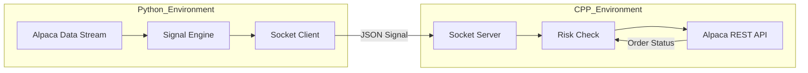

# Livenode Design Document

## 1. Overview
Livenode is a modular trading bot architecture that separates logic (Python) from execution (C++). This separation allows for rapid strategy development while maintaining a robust and performant execution layer.

## 2. Architecture

### 2.1 Component Diagram


### 2.2 Data Flow
1. **Ingestion**: Python streams real-time bar data from Alpaca via WebSockets.
2. **Analysis**: Indicators are calculated using `pandas`.
3. **Signal**: If strategy conditions are met (e.g., `SMA_20 > SMA_50`), a signal is generated.
4. **IPC**: A JSON packet is sent over a local TCP socket:
   ```json
   {
     "symbol": "BTC/USD",
     "qty": 0.01,
     "side": "buy",
     "type": "market"
   }
   ```
5. **Execution**: C++ receives the packet, validates the quantity and symbol, and performs an authenticated HTTP POST request to Alpaca's `/v2/orders` endpoint.

## 3. Technology Stack
- **Python 3.12+**: Logic, Data Processing.
- **C++ 17+**: Execution, Network Server.
- **Alpaca API**: Brokerage interface (Paper Trading).
- **Communication**: TCP Sockets (localhost).

## 4. Safety & Risk Management
- **Paper Trading Only**: The bot is hardcoded to use the Alpaca paper trading base URL.
- **Quantity Limits**: The C++ layer will enforce a maximum position size per trade.
- **Heartbeat**: Python will send periodic heartbeat signals to C++ to ensure the connection is alive.

## 5. Directory Structure
- `src/bot.py`: Main Python entry point.
- `src/strategy.py`: Strategy definitions.
- `src/main.cpp`: C++ server and orchestration.
- `src/orders.cpp`: Alpaca API interaction.
- `api.txt`: API Key and Secret (ignored by git).
