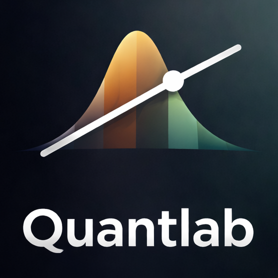
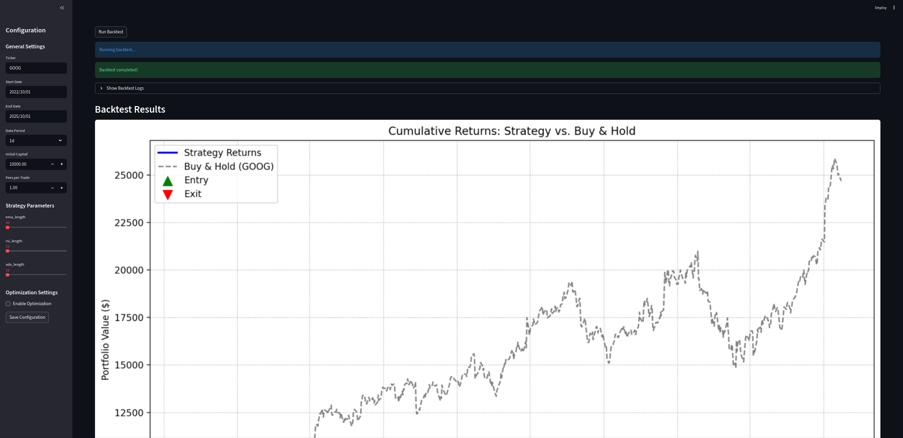
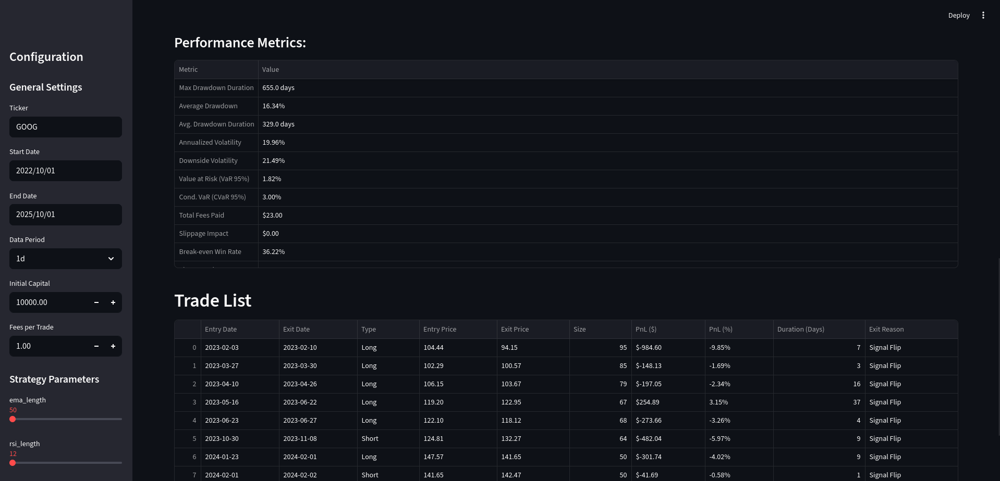

# Quantlab

**Current Version: QL4**\
Quantlab is an open-source backtesting engine. It's part of a series of projects designed to help me get a job in the quantitative analysis industry.

### Features
* Sourcing data from the `yfinance` library
* Defining custom strategies and indicators
* Backtesting said strategies
* Analyzing strategy feasibility, position sizing and various risk-related metrics
* Plotting the size of your backtested portfolio
* Hyperparameter tuning and optimization
* Simple usage and configuration
* Browser UI implemented via Streamlit

### Friendly Warning

For most users, Quantlab isn't enough. Freqtrade is an awesome tool that can actually trade crypto for you, and it has many more features that I simply haven't added. While this project is actively maintained and worked upon, it will most likely never beat Freqtrade.

### Getting Started

Create a virtual environment with `python -m venv venv`, then run `source venv/bin/activate` or another method of using the virtual environment. Install dependencies via `pip install -r requirements.txt`. Then execute `python src/main.py` and you'll soon see a dashboard pop up in your browser. From there you can make changes to your configuration, run backtests and optimizations.

### Showcase

